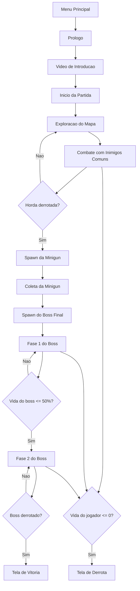

# Jhoon - Documentacao para Zenodo

Documento elaborado com base na estrutura do arquivo `Game-Design-Document-Template.pdf`, adaptado para o projeto `Jhoon`.

## 1. Game Design Document (GDD)

### Game Name
Jhoon

### Genre
Jogo de tiro em primeira pessoa com exploracao, combate e boss fight, inspirado em FPS classicos de estilo retro.

### Game Elements
Os principais elementos de jogo sao:

- exploracao de mapa em pseudo-3D
- combate contra inimigos
- coleta de itens e armas
- progressao por objetivos
- boss final com segunda fase
- HUD com informacoes de estado
- interacao por teclado e mouse

### Player
O jogo foi projetado para 1 jogador por vez.

## 2. Technical Specs

### Technical Form
O projeto utiliza uma representacao 2D do mapa com renderizacao pseudo-3D feita por raycasting. Nao utiliza uma engine 3D completa.

### View
Visao em primeira pessoa.

### Platform
PC

### Language
Python

### Device
Computador desktop ou notebook com suporte a Python e Pygame.

## 3. Game Play

Em `Jhoon`, o jogador assume a perspectiva de um sobrevivente preso em um ambiente sombrio e labirintico. A experiencia e focada em deslocamento em primeira pessoa, combate com armas de diferentes caracteristicas, coleta de itens e sobrevivencia contra inimigos espalhados pelo mapa. O jogador comeca explorando o cenario, eliminando inimigos comuns e buscando itens que destravam novos recursos de combate. Ao longo da partida, o jogo apresenta uma progressao simples e clara: primeiro sobreviver, depois limpar a horda de inimigos, em seguida obter a minigun e, por fim, enfrentar o boss final. A luta final evolui em dificuldade quando o chefe entra em uma segunda fase, alterando a dinamica do confronto.

### Game Play Outline

#### Opening the game application
O jogador inicia o jogo pelo menu principal.

#### Game options
O projeto possui menu inicial, tela de prologo, video de introducao e menu de desenvolvedor.

#### Story synopsis
O protagonista chega a uma cidade e, apos um evento sobrenatural envolvendo neblina, desperta em um labirinto sombrio cheio de criaturas hostis.

#### Modes
O jogo possui:

- modo normal
- modo desenvolvedor, com vantagens para testes

#### Game elements
Os elementos centrais sao:

- movimentacao em primeira pessoa
- tiro com armas diferentes
- inimigos com IA
- pickups de boost e armas
- minimapa
- boss com segunda fase

#### Game levels
O jogo acontece em um mapa unico com progressao interna:

1. sobrevivencia inicial
2. eliminacao da horda
3. liberacao e coleta da minigun
4. confronto com o boss final
5. segunda fase do boss

#### Player controls

- `W`, `A`, `S`, `D`: movimentacao
- `Mouse`: rotacao da camera
- `Botao esquerdo do mouse`: atirar
- `E`: interagir
- `Enter`: avancar em telas de menu e historia
- `Escape`: abrir o menu de desenvolvedor
- `D`: alternar o modo dev dentro do menu dev

#### Winning
O jogador vence ao derrotar o boss final.

#### Losing
O jogador perde quando sua vida chega a zero.

#### End
Ao vencer, a tela de vitoria e exibida e o jogo pode ser reiniciado.

#### Why is all this fun?
O projeto combina ritmo rapido, inspiracao em FPS classicos, progressao de arsenal, combate direto e uma luta final com escalada de dificuldade. O minimapa, o boss em duas fases e as trocas de arma reforcam a variedade e o senso de progressao.

## 4. Key Features

- renderizacao pseudo-3D via raycasting
- controle em primeira pessoa com mouse
- sistema de armas com hand, shotgun, modo especial e minigun
- inimigos com perseguicao, ataque e animacoes
- pickups de arma e boost
- HUD com vida, rosto do jogador, minimapa e mensagens
- menu inicial, prologo e video de introducao
- boss final com segunda fase
- efeitos sonoros e troca dinamica de trilha sonora

## 5. Design Document

Este documento descreve a logica central do jogo, seus objetos, regras e relacoes entre sistemas. A arquitetura foi organizada em modulos independentes para facilitar manutencao, leitura e extensao do projeto.

### Estrutura principal do projeto

- `main.py`: loop principal do jogo
- `settings.py`: constantes e configuracoes
- `map.py`: definicao do mapa
- `player.py`: logica do jogador
- `weapon.py`: sistema de armas
- `raycasting.py`: renderizacao pseudo-3D das paredes
- `sprite_object.py`: sprites, pickups e objetos interagiveis
- `npc.py`: IA dos inimigos e do boss
- `object_handler.py`: gerenciamento de sprites, NPCs e progressao
- `object_renderer.py`: HUD e renderizacao de elementos visuais
- `sound.py`: efeitos sonoros e trilhas
- `menu.py`: menu inicial, prologo e menu dev
- `pathfinding.py`: navegacao dos NPCs

## 6. Design Guidelines

- manter a identidade visual inspirada em FPS retro
- usar mecanicas simples, objetivas e de resposta rapida
- preservar a sensacao de progressao por armas e combate
- manter a arquitetura modular em arquivos separados por responsabilidade
- favorecer clareza de leitura do codigo para fins academicos e de manutencao

## 7. Game Design Definitions

### Objetivo principal
Sobreviver ao mapa, derrotar a horda inicial, obter a minigun e vencer o boss final.

### Condicao de vitoria
Derrotar o boss final.

### Condicao de derrota
Ficar com a vida zerada.

### Progressao
A progressao acontece pela eliminacao dos inimigos comuns, liberacao da minigun e, depois, ativacao da luta contra o boss.

### Transicao de fases
O boss final entra na fase 2 quando sua vida cai para 50% ou menos.

### Foco principal da jogabilidade
Combate em primeira pessoa com exploracao de mapa, gerenciamento de armas e sobrevivencia.

## 8. Game Flowchart

### Fluxo textual

1. Menu principal
2. Tela de prologo
3. Video de introducao
4. Inicio da partida
5. Exploracao e combate contra inimigos comuns
6. Coleta de itens e desbloqueio de armas
7. Derrota da horda
8. Spawn da minigun
9. Coleta da minigun
10. Spawn do boss final
11. Fase 1 do boss
12. Fase 2 do boss
13. Vitoria ou derrota

### Fluxograma em Mermaid



## 9. Recursos Tecnicos e Dependencias

### Dependencias principais

- Python 3.10 ou superior
- Pygame
- OpenCV

### Instalacao

```bash
pip install -r requirements.txt
```

### Execucao

```bash
python main.py
```

## 10. Recursos de Midia

O projeto utiliza arquivos locais presentes na pasta `resources/`, incluindo:

- texturas de parede
- imagens de HUD
- sprites de armas
- sprites de inimigos
- imagens de menu
- efeitos sonoros
- trilhas musicais
- video de introducao

## 11. Relevancia para Preservacao e Deposito no Zenodo

Este projeto e adequado para deposito no Zenodo por reunir:

- codigo-fonte completo e modular
- recursos de midia locais organizados
- mecanicas implementadas e funcionais
- documentacao de estrutura e gameplay
- valor academico para estudos de raycasting, organizacao de jogos 2D/3D simulados e programacao com Pygame

## 12. Sugestao de Metadados para Zenodo

### Title
Jhoon: First-Person Retro-Inspired Raycasting Game in Python and Pygame

### Description
Jhoon is a first-person game developed in Python with Pygame, inspired by retro shooters such as Wolfenstein 3D and DOOM. The project uses raycasting to simulate a pseudo-3D environment, including enemy AI, pickups, multiple weapons, a minimap, dynamic HUD, menus, sound system, and a two-phase final boss battle.

### Keywords

- Python
- Pygame
- Raycasting
- FPS
- Retro Game
- Game Development
- Artificial Intelligence
- Boss Fight

### License
Definir conforme a licenca que voce deseja usar no repositorio. Se ainda nao houver licenca, recomenda-se escolher uma antes do deposito.

## 13. Creditos

Projeto desenvolvido por Joao Victor Barros.

Inspirado em jogos classicos de tiro em primeira pessoa com estetica retro e implementado com Python e Pygame.
